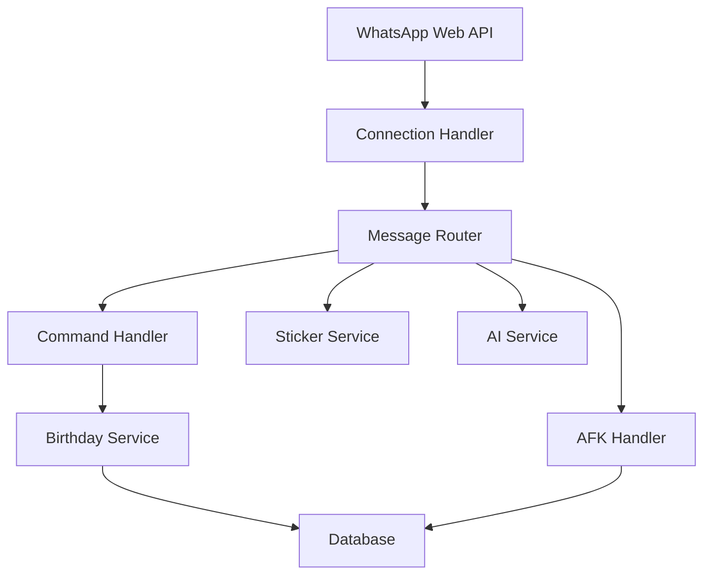

# WhatsApp Birthday Buddy 🎂

> A smart WhatsApp bot that helps you never miss a birthday! Features automatic wishes, AFK responses, and birthday management - all with privacy in mind. Built with Node.js and WhatsApp Web API.

[](https://opensource.org/licenses/MIT)
[](https://github.com/MaheshSharan/WhatsApp-Birthday-Buddy-/stargazers)
[](https://github.com/MaheshSharan/WhatsApp-Birthday-Buddy-/network/members)
[](https://github.com/MaheshSharan/WhatsApp-Birthday-Buddy-/issues)

## Features

### 🎂 Birthday Management
- Add, remove, and list birthdays with ease
- Automatic personalized birthday wishes at midnight
- Bulk import through CSV files
- Birthday statistics and distribution tracking

### 🤖 AI Assistant
- Powered by Qwen2.5-72B-Instruct model
- Smart contextual conversations
- Special handling for thank you messages
- Concise and accurate responses

### 🎯 Sticker Creation
- Quick commands: `!sticker` or `!s`
- Background removal with remove.bg API
- Support for both images and videos
- Options: `nobg`, `circle`
- Clean chat with in-place message editing

### 🌙 Smart AFK System
- Auto-respond when you're away
- Intelligent message filtering
- Auto-disable when owner returns
- Separate owner notifications
- Promotional message detection

### 🛡️ Security & Privacy
- Local data storage
- Phone number validation
- Suspicious number detection
- Business message filtering
- Comprehensive security logging

### 📊 Performance Monitoring
- Real-time uptime tracking
- Memory usage statistics
- Node version information
- Birthday distribution analytics
- Command usage tracking

## Command Reference

| Command | Format | Description |
|---------|--------|-------------|
| Add Birthday | `@smartbot addBD.Name,DD/MM/YYYY,+PhoneNumber` | Add a new birthday |
| Remove Birthday | `@smartbot removeBD.+PhoneNumber` | Remove a birthday |
| List Birthdays | `@smartbot listBD` | Show all birthdays |
| Enable AFK | `@smartbot AFK` | Enable away mode |
| Disable AFK | `@smartbot AFKOFF` | Disable away mode |
| Status | `@smartbot status` | Show bot statistics |
| Create Sticker | `@smartbot !sticker` or `!s` | Create sticker from media |
| Remove BG Sticker | `@smartbot !sticker nobg` | Create sticker without background |
| Circular Sticker | `@smartbot !sticker circle` | Create circular sticker |
| Bulk Import | Send CSV with `@smartbot importBD` | Import multiple birthdays |

### Media Handling
- Support for quoted messages
- Caption processing in media
- Temporary file management
- Multiple media format support
- Automatic cleanup

### Bulk Birthday Import

CSV format requirements:
```csv
Name,Birthday,PhoneNumber
John Doe,25/12/1990,+1234567890
Jane Smith,01/01/1995,+9876543210
```

**Requirements:**
- Header: `Name,Birthday,PhoneNumber`
- Date format: `DD/MM/YYYY`
- Phone: Country code with `+`
- No spaces in CSV (except names)

## Environment Variables

Create a `.env` file:
```env
# AI Configuration
HUGGINGFACE_API_KEY=your_api_key_here

# Background Removal
REMOVE_BG_API_KEY=your_api_key_here

# Database Configuration
DB_PATH=./database/birthday.db

# Bot Configuration
BOT_PREFIX=@smartbot

# Owner Configuration
OWNER_NUMBER=911234567890  # Without +
```

## Architecture

The bot follows a modular architecture:



### Core Components
- Connection Handler: Manages WhatsApp Web connection using Baileys
- Message Router: Routes messages to appropriate handlers
- Command Handler: Processes user commands
- Birthday Service: Manages birthday operations
- Sticker Service: Handles sticker creation
- AI Service: Manages conversations
- Database: SQLite storage for data
- Security: Validates and logs activities

## Security Features
- Phone number validation
- Suspicious pattern detection
- Business message filtering
- Activity logging
- Local data storage
- No external data sharing

## Performance Features
- Uptime monitoring
- Memory usage tracking
- Command statistics
- Error logging
- Birthday analytics

---
## Dependencies

- `@whiskeysockets/baileys`: WhatsApp Web API client
- `sqlite3`: Database management
- `node-cron`: Scheduled tasks
- `dotenv`: Environment configuration

## Contributing

Contributions are welcome! Please feel free to submit a Pull Request. For major changes, please open an issue first to discuss what you would like to change.

## License

This project is licensed under the MIT License - see the [LICENSE](LICENSE) file for details.

> **Note:** This project is not affiliated with WhatsApp or Meta. Use at your own discretion and in accordance with WhatsApp's terms of service.