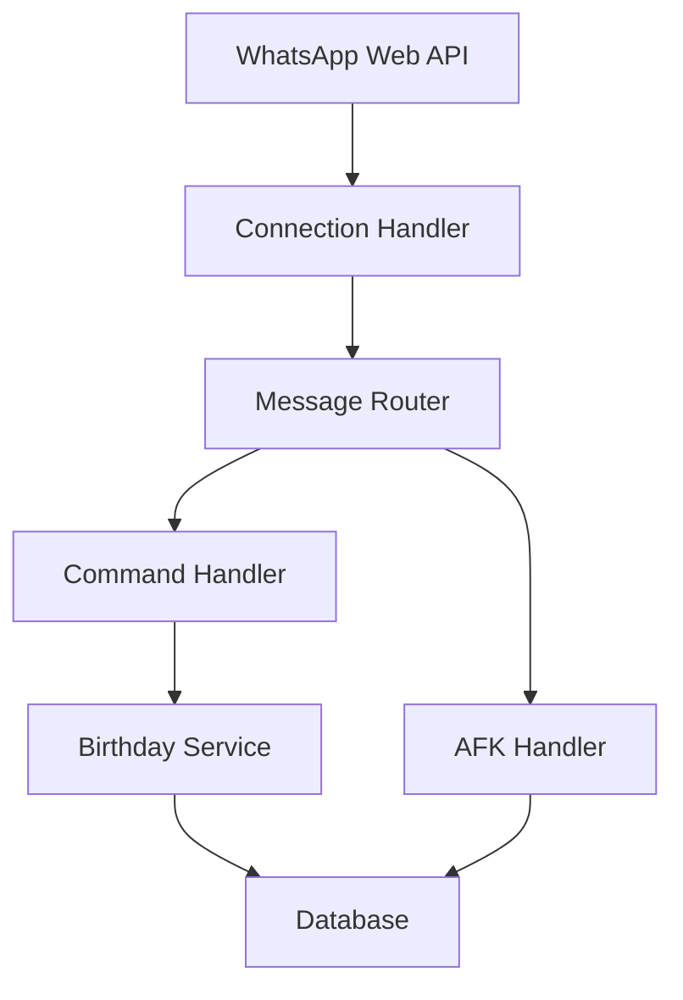

# WhatsApp Birthday Buddy 🎂

> A smart WhatsApp bot that helps you never miss a birthday! Features automatic wishes, AFK responses, and birthday management - all with privacy in mind. Built with Node.js and WhatsApp Web API.

[](https://opensource.org/licenses/MIT)
[](https://github.com/MaheshSharan/WhatsApp-Birthday-Buddy-/stargazers)
[](https://github.com/MaheshSharan/WhatsApp-Birthday-Buddy-/network/members)
[](https://github.com/MaheshSharan/WhatsApp-Birthday-Buddy-/issues)

## Features

- Birthday Management: Add, remove, and list birthdays with ease
- Automatic Wishes: Send personalized birthday wishes automatically at midnight
- AFK System: Auto-respond when you're away
- Statistics: Track birthdays and bot performance
- Privacy-Focused: Runs locally, no data sent to external servers

## Architecture

The bot follows a modular architecture for maintainability and scalability:



### Core Components

- Connection Handler: Manages WhatsApp Web connection using Baileys
- Message Router: Routes messages to appropriate handlers
- Command Handler: Processes user commands
- Birthday Service: Manages birthday-related operations
- Database: SQLite storage for birthdays and bot state

## Command Reference

| Command | Format | Description |
|---------|--------|-------------|
| Add Birthday | `@smartbot addBD.Name,DD/MM/YYYY,+PhoneNumber` | Add a new birthday |
| Remove Birthday | `@smartbot removeBD.+PhoneNumber` | Remove a birthday |
| List Birthdays | `@smartbot listBD` | Show all birthdays |
| Enable AFK | `@smartbot AFK` | Enable away mode |
| Disable AFK | `@smartbot AFKOFF` | Disable away mode |
| Status | `@smartbot status` | Show bot statistics |
| Bulk Import | Send CSV file with caption `@smartbot importBD` | Import multiple birthdays from CSV |

### Bulk Birthday Import

You can import multiple birthdays at once using a CSV file. Your Excel/CSV file should look like this:

| Name           | Birthday   | PhoneNumber  |
|---------------|------------|--------------|
| John Doe      | 25/12/1990 | +1234567890  |
| Jane Smith    | 01/01/1995 | +9876543210  |
| Alice Johnson | 15/03/1988 | +1122334455  |

Save this as a CSV file (e.g., `birthdays.csv`).

**CSV Requirements:**
- First row must be the header: `Name,Birthday,PhoneNumber`
- Birthday format: `DD/MM/YYYY`
- Phone numbers must include country code with `+` prefix
- No spaces in the CSV format (except in names)

To import:
1. Create your CSV file following the format above
2. Send the CSV file to the bot
3. Add caption: `@smartbot importBD`

The bot will process the file and add all birthdays, skipping any duplicates or invalid entries.

## Environment Variables

Create a `.env` file in the root directory:

```env
# AI Configuration (Optional)
HUGGINGFACE_API_KEY=your_api_key_here

# Database Configuration
DB_PATH=./database/birthday.db

# Bot Configuration
BOT_PREFIX=@smartbot

# Owner Configuration (Required for AFK)
OWNER_NUMBER=911234567890  # Your number without +
```

### Why OWNER_NUMBER?

The `OWNER_NUMBER` is required for the AFK system to:
1. Restrict AFK commands to the bot owner only
2. Auto-disable AFK when the owner sends messages
3. Send AFK notifications to the correct chat

## Privacy & Security

This bot prioritizes your privacy:
- Runs completely on your local machine
- No data sent to external servers
- WhatsApp session data stored locally
- No message content stored in database
- Open-source code for transparency

## Getting Started

1. Clone the repository:
```bash
git clone https://github.com/MaheshSharan/WhatsApp-Birthday-Buddy-.git
cd WhatsApp-Birthday-Buddy-
```

2. Install dependencies:
```bash
npm install
```

3. Set up environment variables:
```bash
cp .env.example .env
# Edit .env with your configuration
```

4. Start the bot:
```bash
npm start
```

5. Scan the QR code with WhatsApp to connect

## Dependencies

- `@whiskeysockets/baileys`: WhatsApp Web API client
- `sqlite3`: Database management
- `node-cron`: Scheduled tasks
- `dotenv`: Environment configuration

## Contributing

Contributions are welcome! Please feel free to submit a Pull Request. For major changes, please open an issue first to discuss what you would like to change.

## License

This project is licensed under the MIT License - see the [LICENSE](LICENSE) file for details.

## Disclaimer

This project is not affiliated with WhatsApp or Meta. Use at your own discretion and in accordance with WhatsApp's terms of service.
